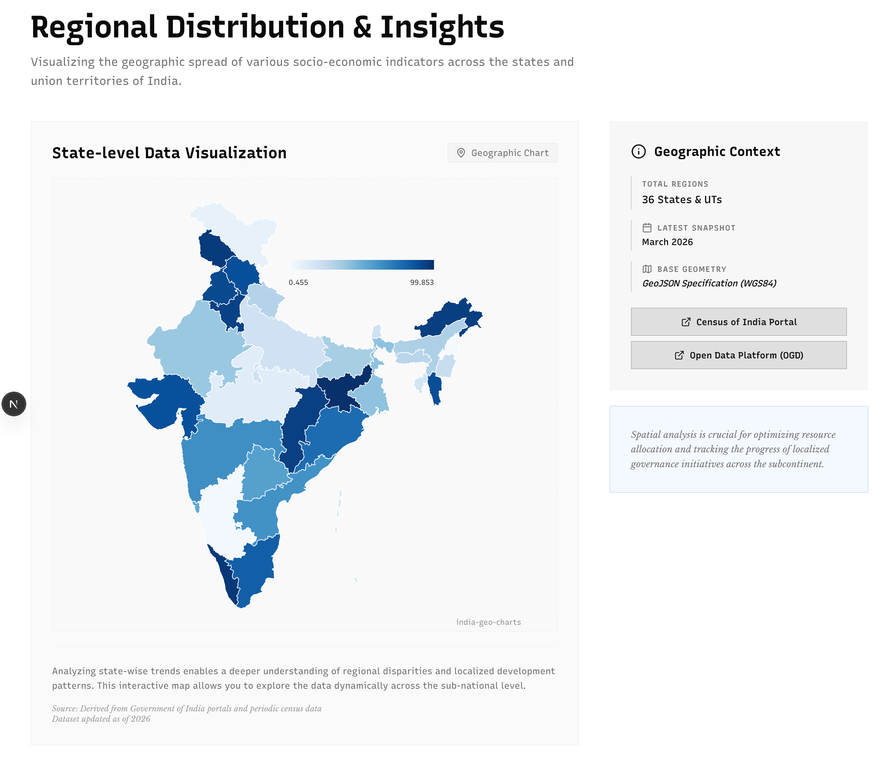

# Examples
## Export SVG
A file to generate a sample choropleth chart of India, and export it as an SVG.

### Running the example
1. Transpile the code from Typescript to Javascript.
    ```bash
    tsc export-svg.ts --module esnext --target esnext
    ```
2. Execute the transpiled code.
    ```bash
    node export-svg.js
    ```

## Nextjs / React example
A simple NextJs example with a component file, and a `page.tsx` file to visualize random data on the topological map of India.

### Running the example
1. Copy `IndiaGeoMap.tsx` into your `components` folder.
2. Copy `page.tsx` into it's own folder within your NextJs / React app.
3. Copy the `docs/examples/react/india-random-topo-data.json` data file somewhere in your project.
4. Modify import paths so that they reflect the new locations of the files.
5. Run your app and navigate to the correct url slug.

### Preview

